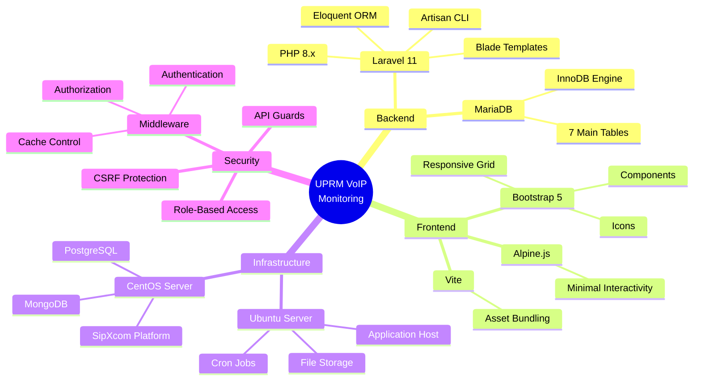

# UPRM VoIP Monitoring System - Architecture Diagram (Mermaid)

## Complete System Architecture

```mermaid
graph TB
    subgraph External["External Systems - SipXcom Platform (CentOS)"]
        PG[(PostgreSQL<br/>Phone Config)]
        MG[(MongoDB<br/>SIP Registrations)]
        CSV[CSV Export<br/>phone.csv + users.csv]
    end

    subgraph ETL["ETL Pipeline - Ubuntu Server"]
        CRON[Cron Job<br/>Every 5 minutes]
        SCP[SCP Transfer<br/>Remote → Local]
        ETL[ETLService<br/>Data Processing]
        IMPORT[DataImportService<br/>CSV Parser]
    end

    subgraph AppDB["Application Database - MariaDB (Ubuntu)"]
        DB[(MariaDB - InnoDB<br/>devices, extensions, networks<br/>buildings, users, alert_settings<br/>device_activity)]
    end

    subgraph Model["Model Layer - Business Logic"]
        MODELS[Eloquent Models<br/>User, Devices, Extensions<br/>Network, Building<br/>AlertSettings, DeviceActivity]
        SERVICES[Business Services<br/>NotificationService<br/>BackupService<br/>DeviceActivityService<br/>FileCleanupService]
    end

    subgraph Controller["Controller Layer - Request Orchestration"]
        MIDDLEWARE[Middleware Pipeline<br/>auth - Authentication<br/>AdminOnly - Authorization<br/>CacheManager - Cache Control<br/>MarkUserOnline - Activity<br/>CSRF Protection]
        CONTROLLERS[Controllers<br/>HomeController<br/>DevicesController<br/>AlertsController<br/>AdminController<br/>ReportsController<br/>BuildingController]
        API[API Endpoints<br/>/api/critical-devices/status<br/>/api/device-activity/*<br/>Protected from direct access]
    end

    subgraph View["View Layer - Presentation"]
        BLADE[Blade Templates<br/>home.blade.php - Dashboard<br/>devices.blade.php - Tables<br/>alerts.blade.php - Notifications<br/>reports.blade.php - Search<br/>admin.blade.php - Management]
        ASSETS[Client Assets<br/>Bootstrap 5<br/>Bootstrap Icons<br/>Alpine.js<br/>Vite Build]
    end

    subgraph Infra["Infrastructure - Supporting Systems"]
        EMAIL[SMTP Email<br/>Critical Alerts<br/>Password Resets<br/>Notifications]
        STORAGE[File Storage<br/>Import Archives<br/>Database Backups<br/>Application Logs]
        SCHEDULER[Task Scheduler<br/>ETL Automation<br/>File Cleanup<br/>Weekly Backups<br/>Activity Rotation]
    end

    USER[End User<br/>Web Browser]

    %% External to ETL Flow
    PG -->|Export| CSV
    MG -->|Export| CSV
    CSV -->|Trigger| CRON
    CRON -->|Execute| SCP
    SCP -->|Download| ETL
    ETL -->|Parse| IMPORT
    IMPORT -->|Store| DB

    %% Database to Model
    DB <-->|Eloquent ORM| MODELS
    MODELS <-->|Business Logic| SERVICES

    %% Model to Controller
    MODELS -->|Data| CONTROLLERS
    SERVICES -->|Operations| CONTROLLERS

    %% Request Flow
    USER -->|HTTP Request| MIDDLEWARE
    MIDDLEWARE -->|Authenticated| CONTROLLERS
    MIDDLEWARE -->|Unauthorized| USER
    CONTROLLERS -->|API Response| API
    API -->|JSON| USER
    CONTROLLERS -->|Render| BLADE

    %% View to User
    BLADE -->|HTML| ASSETS
    ASSETS -->|Rendered Page| USER

    %% Infrastructure Connections
    SERVICES -->|Send| EMAIL
    EMAIL -->|Notify| USER
    SERVICES -->|Write| STORAGE
    SCHEDULER -->|Execute| ETL
    SCHEDULER -->|Trigger| SERVICES
    CONTROLLERS -->|Read/Write| STORAGE

    %% Styling
    classDef external fill:#ff6b6b,stroke:#c92a2a,color:#fff
    classDef etl fill:#fd7e14,stroke:#d9480f,color:#fff
    classDef database fill:#51cf66,stroke:#2f9e44,color:#fff
    classDef model fill:#4dabf7,stroke:#1971c2,color:#fff
    classDef controller fill:#339af0,stroke:#1864ab,color:#fff
    classDef view fill:#9775fa,stroke:#6741d9,color:#fff
    classDef infra fill:#f06595,stroke:#c2255c,color:#fff
    classDef user fill:#ffd43b,stroke:#fab005,color:#000

    class PG,MG,CSV external
    class CRON,SCP,ETL,IMPORT etl
    class DB database
    class MODELS,SERVICES model
    class MIDDLEWARE,CONTROLLERS,API controller
    class BLADE,ASSETS view
    class EMAIL,STORAGE,SCHEDULER infra
    class USER user
```

## Detailed Component Flow

### 1. Data Ingestion Flow


### 2. User Request Flow


### 3. Real-time Notifications Flow


### 4. Admin Panel Access Control


### 5. Backup & Restore Flow


### 6. Device Activity Tracking
```mermaid
graph TB
    subgraph DataCollection["Data Collection - Every 5 Minutes"]
        CRON[Cron Scheduler]
        ACTIVITY[DeviceActivityService]
        DEVICES[Query All Devices]
    end

    subgraph Storage["Storage - MariaDB"]
        DA[(device_activity table<br/>288 samples per day<br/>per device)]
    end

    subgraph APIAccess["API Access"]
        API_TODAY[GET /api/device-activity/{id}?day=1<br/>Today's activity]
        API_YESTERDAY[GET /api/device-activity/{id}?day=2<br/>Yesterday's activity]
        API_BOTH[GET /api/device-activity/{id}/both<br/>Both days comparison]
    end

    subgraph FrontendDisplay["Frontend Display"]
        CHART[24-hour Timeline Chart<br/>Green = Online<br/>Red = Offline<br/>Gray = No data]
    end

    CRON -->|Every 5 min| ACTIVITY
    ACTIVITY -->|Sample status| DEVICES
    DEVICES -->|Record sample| DA
    
    API_TODAY -->|Query| DA
    API_YESTERDAY -->|Query| DA
    API_BOTH -->|Query| DA
    
    DA -->|JSON Response| API_TODAY
    DA -->|JSON Response| API_YESTERDAY
    DA -->|JSON Response| API_BOTH
    
    API_TODAY -->|Data| CHART
    API_YESTERDAY -->|Data| CHART
    API_BOTH -->|Data| CHART

    classDef cron fill:#fd7e14,color:#fff
    classDef storage fill:#51cf66,color:#fff
    classDef api fill:#4dabf7,color:#fff
    classDef display fill:#9775fa,color:#fff

    class CRON,ACTIVITY,DEVICES cron
    class DA storage
    class API_TODAY,API_YESTERDAY,API_BOTH api
    class CHART display
```

## Technology Stack Summary



## Key Features & Flows

### Authentication Flow
- User logs in → Credentials validated → Session created → Middleware checks auth on each request
- Logout → Session destroyed → CacheManager prevents back button access

### Authorization Flow  
- AdminOnly middleware checks user role
- Non-admin users redirected with friendly error message
- Admin routes: /admin, /admin/users, /admin/backup, etc.

### ETL Pipeline
- Runs every 5 minutes via cron
- Downloads CSV from SipXcom (CentOS)
- Parses phone.csv and users.csv
- Updates devices and extensions tables in MariaDB
- Maintains data synchronization

### Cache Management
- CacheManager middleware prevents browser caching
- After logout, back button redirects to login
- No-cache headers on all authenticated pages
- 419 Page Expired handler for CSRF token expiration

### API Protection
- API endpoints check for AJAX requests
- Direct browser access blocked
- Returns 403 or redirects to dashboard
- Prevents API URLs in browser history
